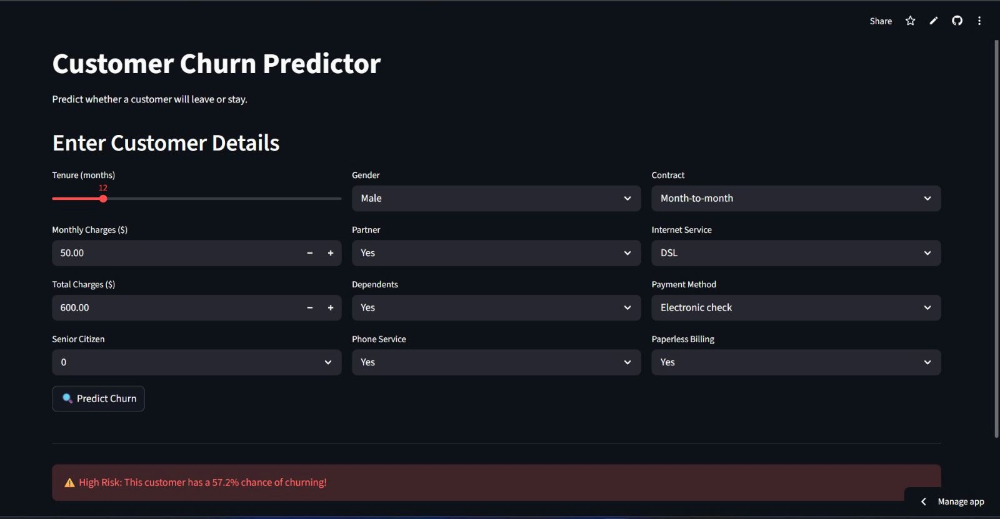

# Customer Churn Predictor
[Live App](https://customer-churn-predictor-mohab.streamlit.app)


A Machine Learning web application that predicts whether a customer is likely to churn (leave a service).
The model analyzes customer information such as tenure, charges, contract type, and services to estimate churn probability.

## Live Application

Try the deployed app here:

https://customer-churn-predictor-mohab.streamlit.app

## Project Overview

Customer churn prediction is a critical task for subscription-based businesses such as telecom companies.
By predicting which customers are likely to leave, companies can take preventive actions to improve retention.

This project demonstrates a complete **end-to-end Machine Learning pipeline**, including:

* Data exploration
* Data preprocessing
* Model training
* Model deployment
* Building an interactive web application

## Features

* Interactive web interface built with **Streamlit**
* Real-time churn prediction
* Probability-based churn risk output
* User-friendly form for entering customer details
* Machine learning model integration

## Technologies Used

Python
Pandas
NumPy
Scikit-learn
Streamlit
Joblib

## Machine Learning Model

The churn prediction model was trained using **Logistic Regression**, a commonly used algorithm for binary classification problems.

Steps used in the ML pipeline:

1. Data Cleaning
2. Feature Encoding
3. Feature Scaling
4. Model Training
5. Model Evaluation
6. Model Serialization using Joblib

## Project Structure

```
customer-churn-predictor
│
├── app
│   ├── app.py
│   ├── churn_model.pkl
│   └── scaler.pkl
│
├── data
│   └── telco_churn.csv
│
├── notebooks
│   └── 01_exploration.ipynb
│
├── .gitignore
└── requirements.txt
```

## How to Run the Project Locally

Clone the repository

```
git clone https://github.com/Mohab-serag/customer-churn-predictor.git
```

Install dependencies

```
pip install -r requirements.txt
```

Run the Streamlit application

```
streamlit run app/app.py
```

The application will open in your browser.

## Example Prediction

The user enters customer information such as:

* Tenure
* Monthly Charges
* Contract Type
* Internet Service
* Payment Method

The model then predicts whether the customer is at **High Risk of Churn** or **Low Risk**.

## Author

Mohab Serag

Data Science & Machine Learning Enthusiast
